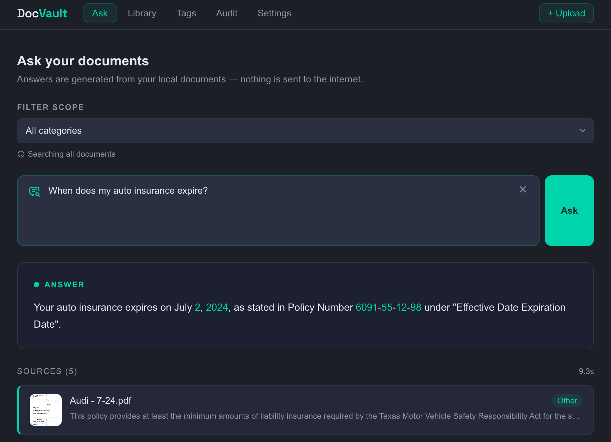
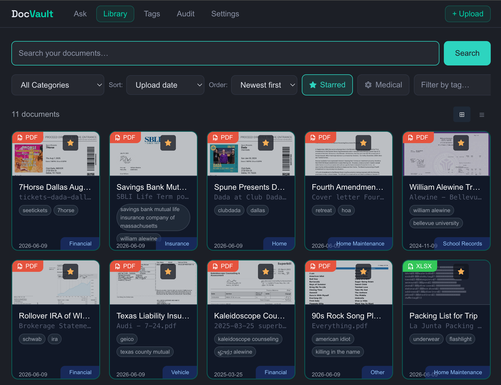
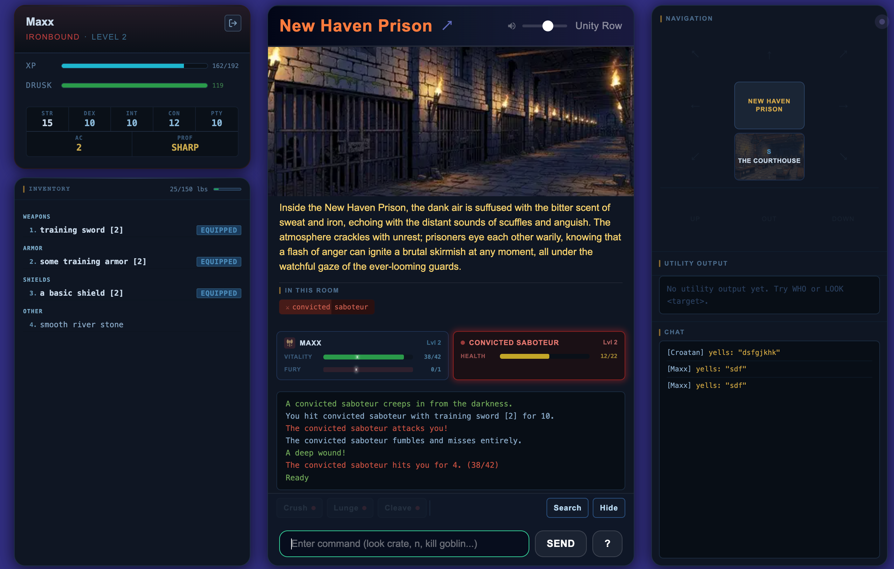

# Bill Alewine

**Engineering Leader** | SaaS | Austin, TX  
Focused on delivery systems, team architecture, and practical AI integration.

---

## What I Do

I run engineering teams — currently a blended onshore/offshore team at a legal tech SaaS company, where most of my energy goes into building the structures that lets engineers do their best work. That means process, capacity modeling, sprint structure, and making sure the team is protected from the noise so they can actually ship.

On the side, I build things to stay sharp and scratch itches that work tools don't cover.

---

## Active Projects

### 🔐 [DocVault](https://github.com/alewine/docvault)  — Local AI Document Management
A fully local, privacy-first document management system. Nothing leaves the machine.

- **Backend:** Python + FastAPI  
- **Frontend:** Next.js 14, TypeScript, Tailwind, Radix UI  
- **Search:** Hybrid — 60% semantic (sqlite-vec cosine similarity) + 40% keyword (SQLite FTS5 BM25)  
- **AI/ML:** `llama3.1:8b` via Ollama for RAG Q&A and auto-summarization; `nomic-embed-text` for embeddings  
- **OCR:** pytesseract + pdf2image for PDFs and images; python-docx, openpyxl, python-pptx for Office formats  
- **Duplicate detection:** SHA-256 hash at upload + greedy cosine similarity clustering at ≥0.97 for near-duplicates  
- **RAG pipeline:** minimum relevance threshold (0.45) to filter weak matches before hitting the LLM; streaming responses via SSE

  
  &nbsp;&nbsp;&nbsp;&nbsp;
  

Built this because I wanted a real RAG implementation I could learn from and a place to store and deep query my documents without handing them to a third party. Supports upload, email, and scanner document ingestion.

### 🏰 [Drusk Haven](https://druskhaven.com) — AI-Assisted Text Adventure
A browser-based text adventure built with TypeScript, Next.js App Router, PostgreSQL (Prisma ORM), and deployed on Railway. The game engine is fully headless, UI-agnostic, with the DB as single source of truth (no in-memory world state). Room images are generated via AI with R2/S3 fallback.

What I found most interesting building this: using Claude Code with `CLAUDE.md` and living spec files as persistent context for the agent. It turned into a genuine experiment in AI-assisted software construction — less about writing code manually and more about designing systems that an AI agent can navigate reliably.

---

## Stack I Work With

`TypeScript` `Next.js` `React` `Python` `FastAPI` `PostgreSQL` `SQLite` `Docker`  
`AWS` `Railway` `Prisma` `Tailwind` `Ollama` `ChromaDB`

**AI tooling I use day-to-day:** Claude Code, Atlassian Rovo, Gemini  
**Eng management tooling:** Jira, Jellyfish, GitHub, Slack

---

## Background

15+ years in software, most of it managing teams. Stops include Litify, RetailMeNot, Ticketmaster/Live Nation, and a few earlier-stage companies. I've managed through a monolith-to-distributed-API migration, built offshore teams from scratch, and spent a lot of time thinking about how to make delivery predictable without just pushing people harder.

More at [linkedin.com/in/alewine](https://linkedin.com/in/alewine)
